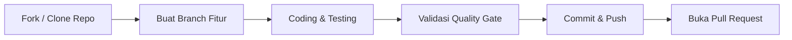

# 🤝 Panduan Kontribusi MyPanel V2

Terima kasih atas minat Anda untuk berkontribusi pada **MyPanel V2**! Kami menyambut baik perbaikan bug, penyempurnaan dokumentasi, maupun fitur baru yang sejalan dengan arsitektur proyek.

Proyek ini mengutamakan **keamanan boundary**, **stabilitas state**, dan **pengalaman pengguna yang responsif**. Harap tinjau pedoman berikut sebelum memulai.

---

## 🧭 Alur Kerja Kontribusi



1. **Cari Issue Terlebih Dahulu**: Pastikan topik atau bug yang ingin Anda kerjakan belum dilaporkan atau sedang dikerjakan oleh orang lain.
2. **Diskusikan Fitur Besar**: Jika Anda merencanakan perubahan arsitektur atau penambahan library besar, diskusikan rancangan dan dampak kompatibilitasnya di GitHub Issues terlebih dahulu.
3. **Branching**: Buat branch terpisah dari `main` atau default branch dengan format deskriptif:
   - `feat/nama-fitur` (contoh: `feat/backup-s3-export`)
   - `fix/nama-bug` (contoh: `fix/console-ansi-parsing`)
   - `docs/nama-dokumen` (contoh: `docs/api-update`)

> [!CAUTION]
> **JANGAN PERNAH** memasukkan file kredensial, token, password, private key sertifikat, file `.env`, dump database, world pemain, atau backup server ke dalam commit atau Pull Request.

---

## 🛡️ Prinsip Keamanan & Desain Arsitektur

Saat menambahkan atau mengubah kode, patuhi prinsip utama MyPanel:

| Prinsip | Keterangan |
| :--- | :--- |
| **Zero Docker Socket in Web/Controller** | Service Web dan Controller **tidak boleh** mengakses Docker socket. Semua operasi container wajib melalui Node Agent via **mTLS**. |
| **Idempotent Migrations** | File migrasi SQL pada `migrations/` harus bersifat aditif dan aman dijalankan berulang kali (`IF NOT EXISTS`). |
| **Opaque Sessions & CSRF** | Endpoint mutasi wajib memvalidasi session cookie di Redis, CSRF token yang cocok, dan origin header yang diizinkan. |
| **Strict Path Traversal Checks** | Seluruh operasi file di Node Agent wajib diverifikasi agar tidak keluar dari direktori data server (melalui traversal `../` maupun symlink). |
| **Resource Quotas** | Setiap container Minecraft baru wajib memiliki batas memori cgroup, limit vCPU, dan penyesuaian JVM headroom. |

---

## 🧪 Quality Gate Sebelum Mengirim PR

Sebelum membuat Pull Request, pastikan seluruh tes dan validasi berikut lulus pada mesin lokal Anda:

### 1. Backend (Go)
```sh
cd controller
go test -race ./...
go vet ./...
```

### 2. Frontend (React + TypeScript + Vite)
```sh
cd web
corepack enable
pnpm install --frozen-lockfile
pnpm lint
pnpm test
pnpm build
```

### 3. Docker Compose & Config
```sh
docker compose config --quiet
```

---

## 📝 Format Pesan Commit

Gunakan standar [Conventional Commits](https://www.conventionalcommits.org/) dalam bahasa imperatif singkat:

- `feat(scope): deskripsi perubahan fitur`
- `fix(scope): deskripsi perbaikan bug`
- `docs(scope): pembaruan dokumentasi`
- `style(scope): penyesuaian visual atau format`
- `refactor(scope): restrukturisasi kode tanpa mengubah perilaku`
- `test(scope): penambahan atau pembaruan test suite`

*Contoh:*
- `feat(agent): validate archive checksum on backup restore`
- `fix(ui): prevent console buffer freezing during high burst logs`

---

## 📬 Melaporkan Kerentanan Keamanan

> [!IMPORTANT]
> Jika Anda menemukan kerentanan keamanan, **JANGAN** membuat issue publik. Silakan ikuti instruksi pengungkapan yang bertanggung jawab pada [SECURITY.md](SECURITY.md).
