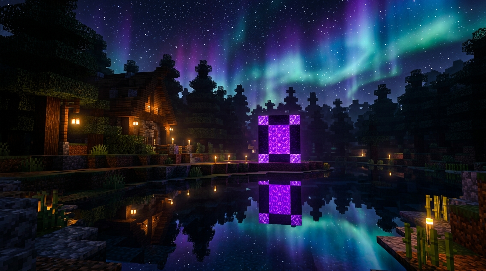
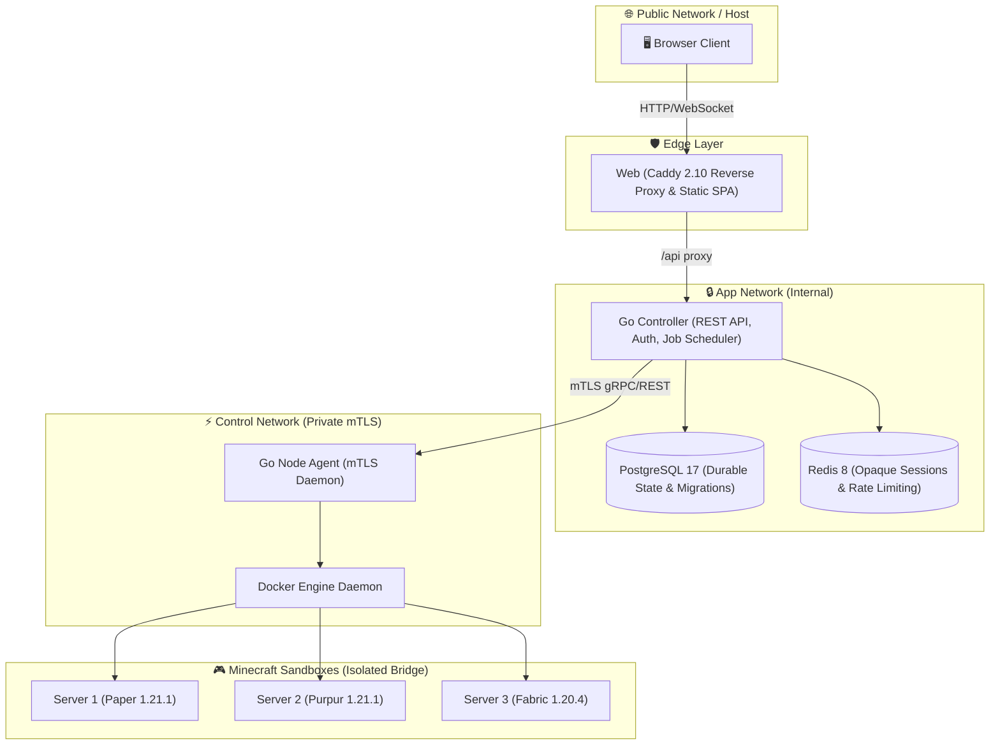
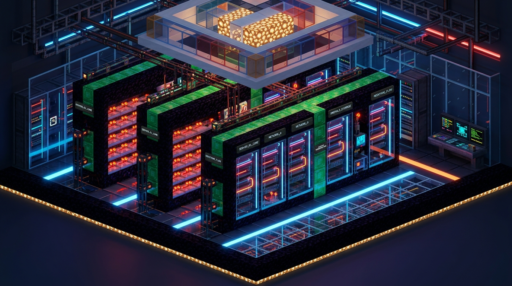

<div align="center">

# ⛏️ MyPanel V2

**Modern Multi-Tenant Minecraft Server Control Plane & Hosting Infrastructure**

[](https://golang.org)
[](https://react.dev)
[](https://www.typescriptlang.org)
[](https://vitejs.dev)
[](https://docker.com)
[](docs/architecture.md)
[](#status-proyek)

<p align="center">
  <a href="#-fitur-utama">Fitur Utama</a> •
  <a href="#-tampilan-antarmuka">Tampilan</a> •
  <a href="#-arsitektur--keamanan">Arsitektur</a> •
  <a href="#-instalasi-cepat">Instalasi</a> •
  <a href="#-alur-hosting-simulasi">Marketplace & Billing</a> •
  <a href="#-dokumentasi">Dokumentasi</a>
</p>


</div>

---

## 📌 Ringkasan

**MyPanel V2** adalah platform *control plane* dan simulasi layanan hosting Minecraft Java multi-tenant untuk satu Linux VM. 

Berbeda dengan solusi panel konvensional, MyPanel dibangun dari nol dengan arsitektur modern yang memisahkan boundary keamanan secara ketat:
- **Frontend**: React 19 + TypeScript + Vite, dikemas dengan tema Minecraft yang elegan, glassmorphism obsidian, telemetri live TPS 20.0, serta dukungan dwibahasa (ID/EN).
- **Controller**: Go backend berkinerja tinggi, mengelola autentikasi Argon2id, session opaque di Redis, state durable di PostgreSQL, serta otorisasi role-based (Owner/User).
- **Node Agent**: Layanan privat yang berkomunikasi dengan Controller secara eksklusif melalui **mTLS internal**. Controller dan Web **tidak pernah** menyentuh Docker socket.
- **Runtime Sandbox**: Setiap instance server Minecraft berjalan dalam container Docker terisolasi dengan kuota cgroup (vCPU, RAM, PID limit, quota storage).

> [!NOTE]
> Transaksi pemesanan dan checkout pada marketplace MyPanel bersifat **simulasi internal** untuk mempermudah alokasi resource dan pengujian kapasitas hosting tanpa gateway pembayaran uang nyata.

---

## 🎮 Tampilan Antarmuka

| Halaman | Deskripsi |
| :--- | :--- |
| **Landing Page (`/`)** | Showcase server Minecraft interaktif, live metrics preview, bento grid fitur, serta integrasi runtime Paper/Purpur/Fabric. |
| **Login Page (`/login`)** | Desain bertema senja Nether portal, kartu obsidian glassmorphic, switch pendaftaran instan, dan password visibility toggle. |
| **Web Console** | Terminal streaming real-time via xterm.js & WebSocket, rendering ANSI true-color, filter event lifecycle, dan eksekusi pipe langsung. |
| **File Manager** | Editor konfigurasi langsung (`server.properties`, yaml), navigasi folder aman tanpa path traversal, drag-and-drop file uploader. |
| **Addons & Modpacks** | Integrasi 1-klik Modrinth API & adapter CurseForge dengan verifikasi checksum SHA-512 dan rollback protektif. |

<div align="center">


*Suasana malam portal nether pada halaman autentikasi MyPanel*

</div>

---

## ✨ Fitur Utama

### 1. 🛡️ Keamanan & Isolasi Tingkat Lanjut
- **Zero Docker Socket Exposure**: Web dan Controller berjalan tanpa hak akses ke Docker daemon. Semua manajemen container didelegasikan ke Agent via **mTLS**.
- **Autentikasi Argon2id & Session Opaque**: Session tersimpan aman di Redis dengan proteksi CSRF token, origin validation, dan rate limiting ketat.
- **Isolasi Kepemilikan (RBAC)**: User hanya dapat melihat dan mengelola instance miliknya sendiri. Owner memiliki hak kontrol penuh atas armada server dan alokasi host.
- **Container Hardening**: Filesystem read-only, capability minimum (`cap_drop: ALL`), dan alokasi UID/GID non-root (`1000:1000`).

### 2. ⚡ Manajemen Server & Runtime Fleksibel
- **Multi-Engine Supported**: Mendukung penuh **PaperMC**, **Purpur**, **Fabric**, **Vanilla**, **Forge**, dan **NeoForge**.
- **Automated Java Provisioning**: Otomatis menyesuaikan runtime Java 21 atau Java 25 berdasarkan versi Minecraft yang dipilih.
- **Real-Time 20.0 TPS Guarantee**: Pemantauan tick rate, latency ping (Server List Ping), penggunaan heap JVM, serta memori cgroup aktual.
- **Named Pipe Console**: Perintah dieksekusi secara instan melalui worker FIFO pipe persisten tanpa overhead spawning proses `docker exec`.

### 3. 📦 Ekosistem Add-on & Modpack 1-Klik
- **Modrinth Catalog**: Cari dan pasang plugin/mod kompatibel secara instan dengan verifikasi dependensi dan SHA-512 checksum.
- **CurseForge Integration**: Pasang modpack lengkap dengan verifikasi manifest, backup pra-instalasi otomatis, dan fallback rollback jika booting gagal.
- **Safe File Management**: Editor file in-browser untuk `server.properties`, plugin config, dan pengelolaan world tanpa risiko path traversal.

### 4. 🛒 Marketplace Kapasitas & Billing Simulasi
- **Paket Hosting Tematik**: Paket bertema Starter, Iron, Gold, dan Diamond dengan konfigurasi tema warna dan ikon SVG lokal.
- **Alokasi Atomic**: Pengecekan sisa vCPU, RAM, disk, dan port secara atomik menggunakan PostgreSQL advisory lock untuk mencegah *overselling*.
- **Siklus Langganan 30 Hari**: Dilengkapi masa tenggang (*grace period*) 7 hari, pelepasan resource otomatis, dan opsi reaktivasi world.

---

## 🏛️ Arsitektur & Keamanan

MyPanel menerapkan prinsip *defense-in-depth* dengan memisahkan jaringan publik dan jaringan kontrol:



Detail boundary dan protokol komunikasi lengkap tersedia di [docs/architecture.md](docs/architecture.md).

<div align="center">


*Visualisasi arsitektur node server container yang terisolasi*

</div>

---

## 🚀 Instalasi Cepat

### Persyaratan Minimum
- **OS**: Linux VM (Ubuntu 22.04/24.04 LTS atau Debian 12 direkomendasikan)
- **Engine**: Docker Engine 24+ & Docker Compose v2
- **Hardware**: Minimal 4 GiB RAM (sisakan memori untuk OS dan stack panel)

### Langkah Instalasi (Linux / macOS)

```sh
# 1. Clone repository
git clone https://github.com/rekis-0103/MyPanel-V2.git
cd MyPanel-V2

# 2. Siapkan file konfigurasi environment
cp .env.example .env

# 3. Generate internal certificates & secure secrets
sh scripts/init-secrets.sh

# 4. Validasi dan jalankan container
docker compose config --quiet
docker compose up --build -d

# 5. Periksa status layanan
docker compose ps
```

### Langkah Instalasi (Windows PowerShell)

```powershell
Copy-Item .env.example .env
./scripts/init-secrets.ps1
docker compose config --quiet
docker compose up --build -d
docker compose ps
```

> [!IMPORTANT]
> Password default akun `admin` pertama kali di-generate secara otomatis dan disimpan di file lokal **`secrets/admin_password`**. File ini diabaikan oleh Git untuk menjamin kerahasiaan kredensial.

Akses panel melalui browser di:
`http://127.0.0.1:8080` (atau IP host VM Anda, misalnya `http://192.168.56.101:8081`).

---

## 🔄 Pembaruan Satu Perintah (`scripts/update.sh`)

Untuk memperbarui instalasi MyPanel di VM langsung dari commit terbaru GitHub:

```sh
cd ~/MyPanel-V2
sh scripts/update.sh
```

**Mekanisme `update.sh`:**
1. Memverifikasi working tree bersih (tanpa perubahan yang belum ter-commit).
2. Melakukan *fast-forward merge* dari origin branch (`feat/mypanel-v1`).
3. Membangun ulang image Docker (`docker compose build --pull`).
4. Menjalankan migrasi database PostgreSQL secara idempotensial (`docker compose run --rm migrate`).
5. Me-restart container dan memvalidasi kesiapan via endpoint health check `http://127.0.0.1:8080/api/v1/health/ready`.

---

## 🛠️ Perintah Operasional

```sh
# Memeriksa kesiapan health check API
curl --fail http://127.0.0.1:8080/api/v1/health/ready

# Melihat log controller dan agent secara real-time
docker compose logs -f --tail=100 controller agent

# Menjalankan test suite backend (Go)
cd controller && go test -race ./...

# Menjalankan test suite frontend (Vitest + TypeScript)
cd web && pnpm test && pnpm build

# Menghentikan stack (data server & database tetap aman di volume)
docker compose down
```

---

## 📂 Struktur Direktori

```text
MyPanel-V2/
├── cmd/
│   ├── controller/      # Entrypoint REST API & worker scheduler
│   ├── agent/           # Privileged mTLS daemon pengelola Docker
│   └── certgen/         # Generator sertifikat internal CA & mTLS
├── internal/            # Core libraries, auth, database, models, & logic
├── migrations/          # File migrasi SQL terurut untuk PostgreSQL
├── scripts/
│   ├── update.sh        # Skrip otomatisasi pembaruan zero-downtime
│   ├── init-secrets.sh  # Generator secret & passphrase untuk Linux
│   └── init-secrets.ps1 # Generator secret untuk Windows PowerShell
├── web/
│   ├── src/
│   │   ├── assets/      # Grafis tema Minecraft, logo, & audio/SVG
│   │   ├── pages/       # Landing, Login, Console, Servers, Dashboard
│   │   ├── layouts/     # Shell navigasi & responsive layout
│   │   └── types.ts     # TypeScript interface & API contracts
│   └── Caddyfile        # Konfigurasi Caddy reverse proxy & header CSP
├── docs/                # Dokumentasi arsitektur, API, dan runbook
└── compose.yaml         # Definisi multi-container Docker stack
```

---

## 📚 Indeks Dokumentasi

- 📐 **[Arsitektur & Trust Boundaries](docs/architecture.md)** — Rincian boundary keamanan, alur data, dan model enkripsi.
- 🔌 **[Kontrak REST API](docs/api.md)** — Spesifikasi endpoint HTTP, payload permintaan, dan kode status.
- 🛡️ **[Runbook Hardening VM](docs/runbooks/vm-hardening.md)** — Panduan isolasi firewall, proteksi SSH, reverse proxy TLS, dan backup off-site.
- 🔄 **[Runbook Pembaruan VM](docs/runbooks/vm-updates.md)** — Prosedur deployment berkelanjutan dan timer otomatis.
- 🤝 **[Panduan Kontribusi](CONTRIBUTING.md)** — Standar kode, quality gate, dan workflow Pull Request.
- 🔐 **[Kebijakan Keamanan](SECURITY.md)** — Tata cara pelaporan kerentanan secara bertanggung jawab.
- 📜 **[Catatan Rilis (Changelog)](CHANGELOG.md)** — Riwayat pembaruan versi dan fitur terkini.

---

## 📄 Lisensi

Proyek ini dikembangkan di bawah lisensi terbuka untuk tujuan simulasi manajemen infrastruktur server Minecraft. Seluruh aset grafis dan ikon atribusi tercatat secara transparan di [web/src/assets/minecraft/ATTRIBUTION.md](web/src/assets/minecraft/ATTRIBUTION.md) dan [web/src/assets/marketplace/ATTRIBUTION.md](web/src/assets/marketplace/ATTRIBUTION.md).

<div align="center">
  <sub>Dibuat untuk Minecraft Server Administrators & Cloud Enthusiasts.</sub>
</div>
