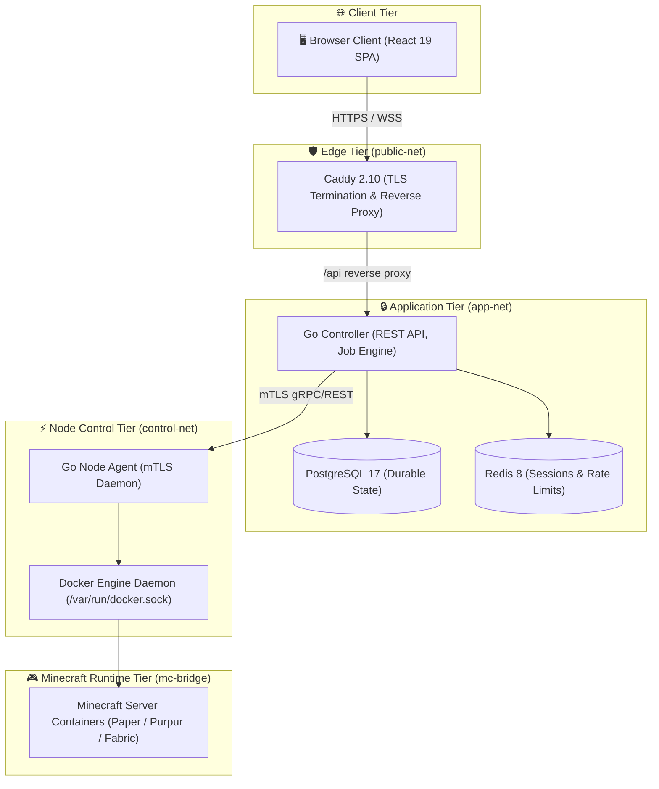
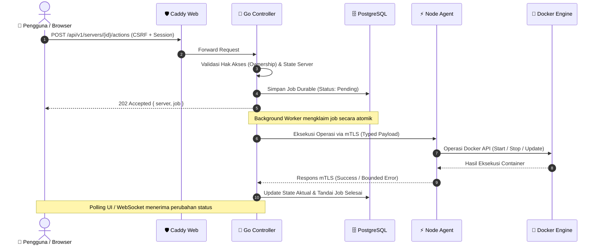

# 📐 Arsitektur Sistem MyPanel V2

Dokumen ini menjelaskan arsitektur internal, batas kepercayaan (*trust boundaries*), aliran data, dan prinsip isolasi keamanan pada **MyPanel V2**.

---

## 🏛️ Topologi Jaringan & Komponen

MyPanel menerapkan prinsip *defense-in-depth* dengan memisahkan jaringan menjadi tiga zona terisolasi:

---

## 🛡️ Batas Kepercayaan (Trust Boundaries)

| Komponen | Hak Akses | Boundary Keamanan & Tanggung Jawab |
| :--- | :--- | :--- |
| **Web (Caddy)** | Non-root (UID 1000) | Menyajikan file statis React SPA dan mem-proxy `/api` ke Controller. Menegakkan CSP (`default-src 'self'`). |
| **Controller** | Non-root (UID 1000) | Boundary aplikasi publik. Mengautentikasi pengguna, memvalidasi CSRF, origin check, dan membuat job rekonsiliasi. **TIDAK memiliki akses ke Docker socket**. |
| **Node Agent** | Root + `DAC_OVERRIDE` | Boundary mesin/node privat. Hanya dapat dihubungi melalui jaringan internal via **mTLS**. Menerima operasi terstruktur khusus UUID server yang terdaftar. |
| **Database (Postgres)** | Internal network | Menyimpan state persisten: users, servers, orders, subscriptions, audit log, dan jobs. |
| **Cache (Redis)** | Internal network | Menyimpan session opaque bertanda versi dan pencatatan sliding-window rate limit. |
| **Container Minecraft** | Unprivileged (`minecraft`) | Workload yang tidak dipercaya (*untrusted workload*). Semua Linux capabilities di-drop (`cap_drop: ALL`), dibatasi cgroup CPU/RAM, dan PID limits. |

---

## 🔄 Alur Data & Mutasi State (Data Flow)

Setiap operasi mutasi (start, stop, restart, deploy paket, konfigurasi) mengikuti alur kerja asinkronus yang andal:

---

## 💾 Penyimpanan & Isolasi Direktori

Seluruh data persisten dipetakan ke direktori lokal dengan aturan hak akses ketat:

| Direktori Host | Path Container | Keterangan & Pengamanan |
| :--- | :--- | :--- |
| `/var/lib/mypanel/servers/<uuid>` | `/data` | Direktori world dan konfigurasi Minecraft. Dimiliki oleh UID/GID `1000:1000`. |
| `/var/lib/mypanel/backups/<uuid>` | `/backups` | Arsip snapshot terkompresi `.tar.gz` yang dilindungi verifikasi checksum SHA-256. |
| `/var/lib/mypanel/patches` | `/patches:ro` | Patch performa internal (misal: optimasi entity explosion Paper) yang dimount read-only. |

---

## ⚡ Konsol Real-Time & Named Pipe Architecture

Untuk performa tinggi tanpa membebani daemon Docker:
1. **Streaming Output**: Live console menghubungkan satu persistent stream Docker langsung ke xterm.js via authenticated WebSocket.
2. **Eksekusi Perintah (Named Pipe)**: Perintah dari browser masuk ke worker queue dan ditulis langsung ke named FIFO pipe pada direktori server (`/data/mypanel_console.pipe`). Ini mengeliminasi overhead pembuatan proses `docker exec` baru pada setiap perintah.
3. **Penerjemahan ANSI & Warna**: Konsol mendukung kode warna Minecraft (`§`), kode legacy Bukkit (`&`), ANSI 256 true-color, dan tag dekorasi MiniMessage.
